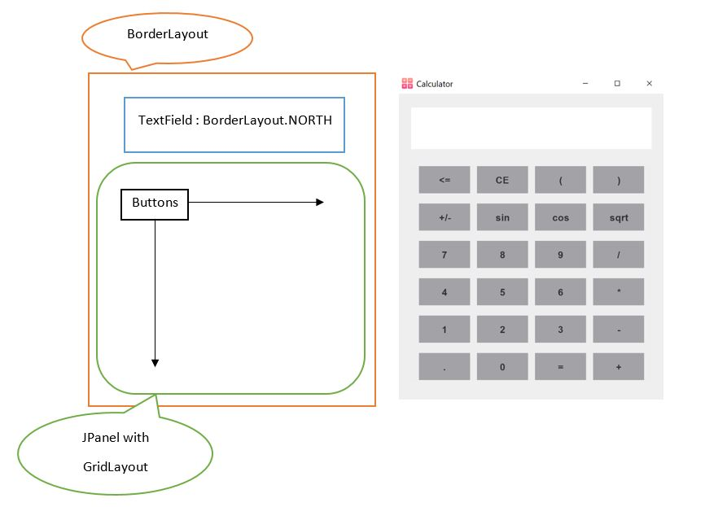

# GUI-Calculator

Simple GUI Calculator using Java Swing and Shunting yard algorithm.
This Calculator also supports Big Decimal numbers as well.

## Object Orientation Structure

| Class | Responsibilty |
| :-: | :-: |
| Main | Opens calculator window |
| CalculatorGUI | Painting the window, Balancing math expression format |
| ActionHandler | Controls user actions |
| CalculationEngine | Checks validation and calculates the expression |

Keyboard buttons recognized by program :
  - Digits (1, 2, ...)
  - Operators (+ - * / =)
  - Dot
  - Backspace
  - Enter

|  |
| :-: |
| GUI Structure |

## TODO
  - Supporting sin, cos and sqrt operations
